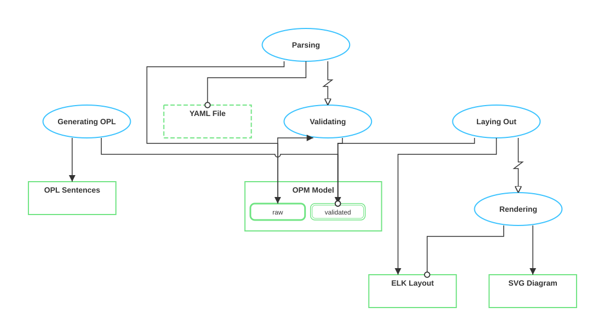

# opl-renderer

Diagrams-as-code for **Object-Process Methodology** (OPM / ISO 19450).

Write your OPM model in YAML, get a clean SVG Object-Process Diagram and OPL (Object-Process Language) sentences.

```
YAML model  ──▶  validate  ──▶  ELK layout  ──▶  SVG + OPL sentences
```

## Quick start

```bash
# Requires Node 20+
nvm use 24            # or whichever Node version you have ≥ 20
npm install
npm run build

# Render a model
node dist/cli.js fixtures/simple.yaml
# → fixtures/simple.svg   (diagram)
# → fixtures/simple.opl   (OPL sentences)
```

Or during development:

```bash
npx tsx src/cli.ts fixtures/simple.yaml
```

## CLI usage

```
opl-render <input.yaml> [-o output.svg]
```

| Flag | Description |
|------|-------------|
| `-o` | Output path for SVG (default: same name as input, `.svg` extension) |

The CLI also writes an `.opl` file with the OPL sentences alongside the SVG.

## YAML model format

```yaml
entities:
  - id: bread
    entityType: object        # "object" or "process"
    name: Bread
    essence: physical         # "physical" or "informatical"
    affiliation: systemic     # "systemic" or "environmental"
    states:                   # only objects can have states
      - name: raw
        initial: true
      - name: baked
        final: true

  - id: baking
    entityType: process
    name: Baking
    essence: informatical
    affiliation: systemic

relationships:
  - id: r1
    subject: { subjectId: bread } # subject of the OPL sentence
    target: { targetId: flour } # target (linguistic object) of the sentence
    relationship: consists of

  - id: r2
    subject: { subjectId: baking }
    target:
      targetId: bread
      targetState:
        targetStateFrom: raw
        targetStateTo: baked
    relationship: changes

  - id: r3
    subject: { subjectId: baking }
    target: { targetId: mixing }
    relationship: invokes
```

### Supported relationships

| Relationship | Link type | Arrow marker |
|---|---|---|
| `consists of` | Aggregation (comb pattern) | Triangle |
| `exhibits` | Exhibition | — |
| `is a` | Generalization | Hollow triangle |
| `handles` | Agent | Filled circle |
| `requires` | Instrument | Hollow circle |
| `yields` | Result | Arrow |
| `consumes` | Consumption | Arrow |
| `changes` | Effect (state pair) | Arrow (two edges: from-state → process → to-state) |
| `invokes` | Invocation | Hollow arrow + Z-shape kink |

### State targeting

- `targetStateAt` — the object must be in this state (instrument/result/consumption)
- `targetStateFrom` / `targetStateTo` — state transition pair (changes relationship)

## OPL sentence output

The renderer generates ISO 19450 OPL sentences. Example output for the Bread model:

```
Bread is a physical and systemic object.
Bread can be raw or baked.
State raw is initial.
State baked is final.
Flour is a physical and environmental object.
Baking is an informatical and systemic process.
Bread consists of Flour, Water, and Yeast.
Baking changes Bread from raw to baked.
Baking invokes Mixing.
```

## Visual features

- **Orthogonal edge routing** via ELK.js — all lines are horizontal or vertical
- **State-targeted edges** — `changes` edges connect directly to the specific state rounded-rects inside the object
- **Comb-style aggregation** — triangle → vertical trunk → horizontal bar → vertical stubs to each child (no lines crossing through unrelated shapes)
- **Z-shaped invocation kink** — `invokes` edges have a Z-shaped kink with hollow arrowhead
- **Line jumps** — semicircular arcs where edges cross
- **OPM styling** — green object rectangles, cyan process ellipses, drop shadow for physical essence, dashed border for environmental affiliation

## MCP server

This package includes an MCP (Model Context Protocol) server so Claude Code, Claude Desktop, or any MCP-compatible client can render OPD diagrams and generate OPL sentences.

### Setup

Build the project first:

```bash
npm install
npm run build
```

Then add the server to your MCP client configuration.

**Claude Code** — create or edit `.claude/settings.json` (project-level) or `~/.claude/settings.json` (global):

```json
{
  "mcpServers": {
    "opl-renderer": {
      "command": "node",
      "args": ["/absolute/path/to/opl-renderer/dist/mcp-server.js"]
    }
  }
}
```

**Claude Desktop** — edit `~/Library/Application Support/Claude/claude_desktop_config.json` (macOS) or `%APPDATA%\Claude\claude_desktop_config.json` (Windows):

```json
{
  "mcpServers": {
    "opl-renderer": {
      "command": "node",
      "args": ["/absolute/path/to/opl-renderer/dist/mcp-server.js"]
    }
  }
}
```

### Available tools

| Tool | Description | Input |
|---|---|---|
| `render_opd` | Render YAML → SVG diagram + OPL sentences | `yaml` (string) |
| `generate_opl` | Generate OPL sentences from YAML | `yaml` (string) |
| `validate_opm` | Validate a YAML model | `yaml` (string) |

### Example prompt

After configuring the MCP server, you can say to Claude:

> "Render an OPD for this model: [paste YAML]"

Claude will call the `render_opd` tool and return the SVG and OPL sentences.

## Dogfooding

The renderer can describe its own pipeline. Run `node dist/cli.js fixtures/self.yaml` to render the self-model:



```
YAML File is an informatical and environmental object.
OPM Model is an informatical and systemic object.
OPM Model can be raw or validated.
State raw is initial.
State validated is final.
ELK Layout is an informatical and systemic object.
SVG Diagram is an informatical and systemic object.
OPL Sentences is an informatical and systemic object.
Parsing is an informatical and systemic process.
Validating is an informatical and systemic process.
Laying Out is an informatical and systemic process.
Rendering is an informatical and systemic process.
Generating OPL is an informatical and systemic process.
Parsing requires YAML File.
Parsing yields OPM Model at state raw.
Validating changes OPM Model from raw to validated.
Laying Out requires OPM Model at state validated.
Laying Out yields ELK Layout.
Rendering requires ELK Layout.
Rendering yields SVG Diagram.
Generating OPL requires OPM Model at state validated.
Generating OPL yields OPL Sentences.
Parsing invokes Validating.
Laying Out invokes Rendering.
```

## Project structure

```
src/
├── types.ts          # Core TypeScript types for the YAML-based OPM model
├── validate.ts       # Schema validator (referential integrity, enum values)
├── layout.ts         # ELK.js graph layout (node positioning + edge routing)
├── svg.ts            # SVG renderer (shapes, edges, markers, aggregation)
├── opl-sentences.ts  # OPL sentence generator from YAML model
├── cli.ts            # CLI entry point (YAML → SVG + OPL files)
├── mcp-server.ts     # MCP server (exposes render/validate/generate tools)
├── ir.ts             # Intermediate representation types (used by parser)
├── parser.ts         # OPL text → IR model parser
├── opl-gen.ts        # IR model → OPL text generator
├── utils.ts          # Shared utilities (ID generation, list formatting)
└── index.ts          # Library exports
fixtures/
├── simple.yaml       # Bread model (6 entities, 7 relationships)
└── self.yaml         # Self-describing model of this renderer's pipeline
```

### Pipeline

```
                    ┌─────────────┐
YAML file ────────▶│  validate   │──▶ errors?
                    └──────┬──────┘
                           │
                    ┌──────▼──────┐
                    │   layout    │──▶ ELK.js positions nodes, routes edges
                    └──────┬──────┘
                           │
                    ┌──────▼──────┐
                    │    svg      │──▶ SVG string
                    └─────────────┘
                           │
                    ┌──────▼──────┐
                    │opl-sentences│──▶ OPL text
                    └─────────────┘
```

## Implementation notes

**Layout**: ELK.js handles hierarchical layered layout with `elk.edgeRouting: 'ORTHOGONAL'`. States are positioned manually inside parent objects (not as ELK children) because OPM shows them as nested rounded-rects, not separate graph nodes.

**State-targeted edges**: For `changes` relationships, layout.ts creates two ELK edges (`-from` and `-to`) and stores the target state IDs. svg.ts adjusts the endpoints to connect to the actual state rectangle positions within the parent object, maintaining orthogonal routing.

**Aggregation rendering**: Uses a "comb" pattern instead of horizontal branches (which would cross sibling shapes). The trunk drops from the parent through a triangle to a horizontal bar positioned above all children, with vertical stubs connecting down to each child.

**Invocation Z-kink**: The longest segment of an invocation edge gets a Z-shaped kink inserted at its midpoint. The hollow arrowhead marker distinguishes it from other edge types.

## Dependencies

| Package | License | Purpose |
|---|---|---|
| [elkjs](https://github.com/kieler/elkjs) | EPL-2.0 | Graph layout engine (orthogonal edge routing, layered positioning) |
| [yaml](https://github.com/eemeli/yaml) | ISC | YAML parsing |
| [@modelcontextprotocol/sdk](https://github.com/modelcontextprotocol/typescript-sdk) | MIT | MCP server framework |

**Dev dependencies**: TypeScript (Apache-2.0), Vitest (MIT), @types/node (MIT).

All licenses are compatible with open-source distribution. EPL-2.0 (elkjs) is a weak copyleft — it applies to modifications of elkjs itself, not to code that uses elkjs as a library.

## License

MIT
